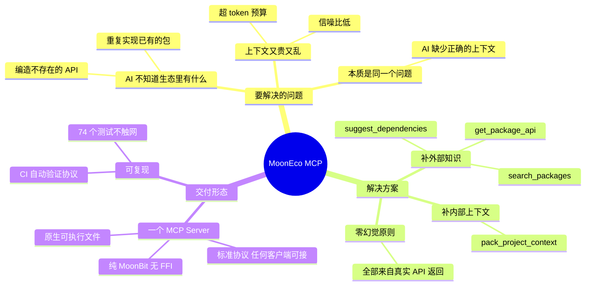
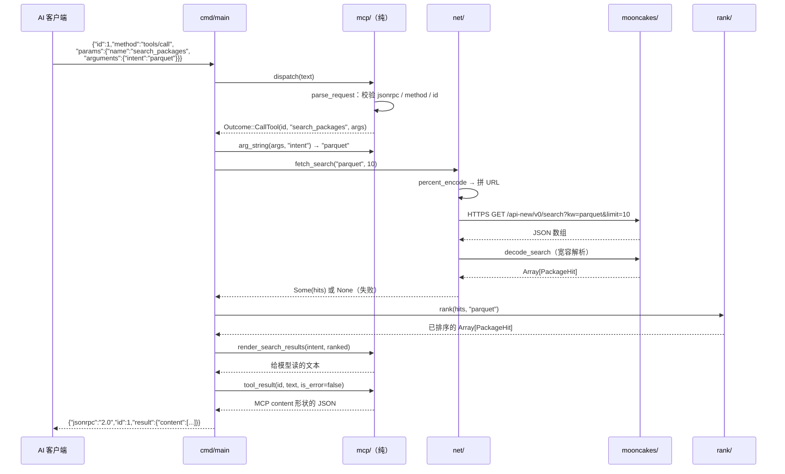

# MoonEco MCP —— 它是什么、怎么实现的、为什么这样设计

> 面向读者的说明文档。目标不是罗列代码，而是讲清**每个设计决定背后的理由**。
>
> 规模参考：自主实现约 **1386 行**（更保守口径 909 行）+ 测试 **742 行**（**74 个测试**），分布在 5 个包里。
> 依赖：`moonbitlang/async`（官方异步库，零依赖）。

---

## 一、它到底是干什么的

**一句话：它是一个"翻译官"，把 MoonBit 生态的真实情况翻译给 AI 听。**

### 先说清楚问题

你用 AI 写 MoonBit 代码时，会发生两件很烦的事：

**第一件：AI 会编 API。**
MoonBit 生态已经有 2000+ 个包，但**这些包不在这几年任何大模型的训练数据里**。
所以 AI 会一本正经地告诉你"调用 `@http.fetch_json()`"，而这个函数根本不存在。
或者它不知道生态里已经有 `mizchi/parquet`，于是花 200 行给你手写一个残缺的 Parquet 解析器。

**第二件：上下文又贵又乱。**
AI 只能看到你塞给它的内容。把整个仓库塞进去——超 token 预算；只塞几个文件——又不确定塞对了没有。

**这两件事看起来是两个问题，其实是同一个：AI 缺少"正确的上下文"。**
它既不知道**外部**（生态里有什么），也拿不到**内部**（项目里哪些内容此刻最重要）。

### 再说解决方案

MoonEco MCP 就是给 AI 补上这两块：

| 缺什么 | 补什么 |
|---|---|
| 不知道生态里有什么包 | `search_packages` / `suggest_dependencies` |
| 不知道某个包的 API 长什么样 | `get_package_api` |
| 不知道自己项目里哪些内容该喂给模型 | `pack_project_context` |

**关键是"真实"两个字**：所有包名、版本、API、依赖关系都来自 mooncakes.io 的**实际返回**，
而不是让模型凭记忆猜。这就是文档里反复强调的"零幻觉"。

---

## 二、整体思维导图



如果上面的图在你这里显示不出来，下面是同一张图的纯文本版：

```
MoonEco MCP
├── 要解决的问题
│   ├── AI 不知道生态里有什么
│   │   ├── 编造不存在的 API          ← 幻觉
│   │   └── 重复实现已有的包          ← 白干
│   ├── 上下文又贵又乱
│   │   ├── 超 token 预算
│   │   └── 信噪比低
│   └── 本质是同一个问题：AI 缺少正确的上下文
├── 解决方案
│   ├── 补外部知识（生态）
│   │   ├── search_packages        按意图检索包
│   │   ├── get_package_api        查真实 API
│   │   └── suggest_dependencies   「我要做 X」→ 该用哪些包
│   ├── 补内部上下文（项目）
│   │   └── pack_project_context   压进 token 预算 + 注入包 API
│   └── 零幻觉原则：全部来自真实 API 返回
└── 交付形态
    ├── 一个 MCP Server
    │   ├── 标准协议 → 任何 MCP 客户端可接
    │   ├── 纯 MoonBit，无 FFI
    │   └── 原生可执行文件
    └── 可复现
        ├── 74 个测试全部不触网
        └── CI 自动验证协议行为
```

---

## 三、什么是 MCP，为什么用它

**MCP（Model Context Protocol）是一个开放协议，规定"AI 客户端"和"工具服务"怎么对话。**

### 为什么需要它

假设没有 MCP：你想让 AI 能查 MoonBit 生态，就得给 Claude 写一个插件、给 Codex 写一个、给 Cursor 再写一个……
每家的接口都不一样，你要维护 N 份。

有了 MCP：**你只实现一次 server，所有支持 MCP 的客户端都能用。**

这就是文档里说的"客户端通用"——不是口号，是协议带来的实际结果。

### 它的对话长什么样

MCP 走 **STDIO**（标准输入输出），**一行一条 JSON**，一问一答：

```
客户端 → {"jsonrpc":"2.0","id":1,"method":"tools/list"}
服务端 ← {"jsonrpc":"2.0","id":1,"result":{"tools":[...]}}
```

看起来简单，但有两条**必须遵守、很容易写错**的规矩：

1. **通知（没有 `id` 的消息）不得回应。**
   客户端会发 `notifications/initialized` 这类消息，它只是"告知"，不需要回答。
   如果你回了，客户端会把这条多余的消息当成下一条请求的响应，**整个对话就错位了**。

2. **stdout 只能写协议消息。**
   任何调试日志如果打到 stdout，就会混进协议流里，客户端解析直接失败。
   （日志必须走 stderr。）

> 这两条我们都有测试盯着：冒烟测试会输入 4 条消息，**断言只得到 3 条回应**。

---

## 四、代码怎么分层，为什么这样分

```
                          AI 编程客户端（Claude / Codex / 任何 MCP 客户端）
                                       │
                                       │  STDIO：一行一条 JSON
                                       ▼
        ┌──────────────────────────────────────────────────────────────┐
        │  cmd/main  ——  传输与装配层（native）                          │
        │  读一行  →  分发  →  必要时执行工具  →  写一行                  │
        └───────────────────────────┬──────────────────────────────────┘
                                    │  @mcp.dispatch(text)
                                    ▼
        ┌──────────────────────────────────────────────────────────────┐
        │  mcp/  ——  协议决定层（纯函数，可在任意后端测试）               │
        │                                                              │
        │   jsonrpc.mbt   解析/构造 JSON-RPC 2.0 消息                    │
        │   server.mbt    dispatch → Respond | NoResponse | CallTool    │
        │   tools.mbt     四个工具的英文目录（描述 + 入参 schema）         │
        │   render.mbt    把数据渲染成给模型读的文本                      │
        └───────────────────────────┬──────────────────────────────────┘
                                    │  Outcome::CallTool(id, name, args)
                                    ▼
        ┌──────────────────────────────────────────────────────────────┐
        │  cmd/main 的工具执行器（async，**唯一允许碰 I/O 的地方**）        │
        └──────┬───────────────────┬───────────────────┬───────────────┘
               ▼                   ▼                   ▼
        ┌────────────┐      ┌────────────┐      ┌──────────────┐
        │  net/      │      │  rank/     │      │  mooncakes/  │
        │  HTTPS 传输 │      │  相关性排序 │      │  JSON 解析    │
        │  (native)  │      │  (纯函数)   │      │  (纯函数)     │
        └────────────┘      └────────────┘      └──────────────┘
               │
               ▼
        mooncakes.io 官方 JSON API
```

### 这个分层对应一个核心原则

> **把"做决定"和"做 I/O"分开。**

看 `mcp/` 这一层：它**不读 stdin、不写 stdout、不联网**。
它只做一件事——拿到一条消息，返回"该做什么"：

```moonbit
pub(all) enum Outcome {
  Respond(String)                  // 直接回应这条 JSON
  NoResponse                       // 是通知，不回应
  CallTool(Json, String, Json?)    // 需要执行工具（id, 名字, 参数）
}
```

**为什么要把"需要联网"这件事做成返回值？**

因为如果 `dispatch` 自己去联网，那么"协议是否正确"就只能**启动一个进程、连上网络**才能验证。
而现在，74 个测试里有 33 个直接测协议行为——**不开进程、不连网络、毫秒级跑完**。

评审断网也能复跑，这不是巧合，是分层换来的。

---

## 五、一次 `search_packages` 调用的完整旅程

以真实调用为例：AI 想找解析 Parquet 的包。



纯文本版：

```
AI 客户端
  │ ① tools/call search_packages {"intent":"parquet"}
  ▼
cmd/main            读一行 JSON
  │ ②
  ▼
mcp.parse_request   校验 jsonrpc / method / id       ← 纯函数
  │ ③
  ▼
mcp.dispatch        → Outcome::CallTool(id, name, args)   ← 纯函数，不联网
  │ ④
  ▼
cmd/main            取参数 intent = "parquet"
  │ ⑤
  ▼
net.fetch_search    HTTPS GET mooncakes.io            ← 唯一碰网络的地方
  │                    失败 → None（与"无结果"区分）
  ▼
mooncakes.decode    JSON → Array[PackageHit]           ← 纯函数
  │ ⑥
  ▼
rank.rank           打分 + 稳定排序                     ← 纯函数
  │ ⑦
  ▼
mcp.render          渲染成给模型读的文本                 ← 纯函数
  │ ⑧
  ▼
mcp.tool_result     包成 MCP 的 content 形状            ← 纯函数
  │ ⑨
  ▼
cmd/main            写一行 JSON
  │ ⑩
  ▼
AI 客户端收到结果
```

**注意：十步里只有第 ⑤ 步碰网络。其余全是纯函数——所以它们全都能被单元测试覆盖。**

---

## 六、每个模块负责什么，以及为什么这么切

### `mooncakes/` —— 解析真实 API 的返回

| 文件 | 职责 |
|---|---|
| `types.mbt` | `PackageHit` 结构：包名、版本、许可证、下载量、发布时间、是否新包 |
| `decode.mbt` | 把 JSON 数组解析成 `PackageHit` 列表 |
| `fixtures.mbt` | **录制的真实 API 响应**（测试用） |

**关键设计：宽容解析。**

```moonbit
// 行为约定（对调用方稳定）：
// - JSON 语法错误 / 顶层不是数组  → 返回空数组，不抛异常
// - 数组元素不是对象             → 跳过该元素，保留其余
// - 字段缺失或类型不符           → 取默认值（"" / 0 / []）
```

**为什么宽容？** 上游 API 会演进。如果对方加个字段、改个类型就让我们的工具整体挂掉，
那这个工具在真实世界里就不可用。**"能降级"比"严格正确"更重要**——这是工具类软件的现实取舍。

### `net/` —— 唯一碰网络的地方

| 文件 | 职责 |
|---|---|
| `endpoint.mbt` | 拼 URL + 百分号编码（**纯函数，可测**） |
| `client.mbt` | 发 HTTPS 请求（async，native） |

**三个值得一提的决定：**

**① URL 拼接被拆成纯函数，是为了能测。**
`search_url("http server", 5)` 会产生 `?kw=http%20server&limit=5`——空格必须编码成 `%20`。
这种细节最容易写错，也最容易测。

**② `fetch_search` 返回 `Option`，而不是空数组。**

```moonbit
pub async fn fetch_search(keyword, limit) -> Array[@mooncakes.PackageHit]?
//   None     → 请求失败（网络不可达 / 响应不是合法 JSON）
//   Some([]) → 请求成功，但没有匹配结果
```

**为什么这个区分很重要？**
因为对 AI 来说，这两件事应该导致**完全不同的行为**：

| 情况 | 正确的后续动作 |
|---|---|
| 网络失败（`None`） | 重试、或改用缓存、或告诉用户检查网络 |
| 真没结果（`Some([])`） | **换关键词、换同义词** |

如果合并成空数组，AI 会以为"MoonBit 生态里没有 Parquet 库"——
于是**放弃一个其实存在的方案**。这个 bug 不会报错，只会让 AI 悄悄做出错误的决定。

**③ README 抓取必须多源 + 超时，因为「取不到」和「挂住」是两回事。**

mooncakes.io 不提供 README 正文（`metadata.readme` 只是文件名），
而 MoonBit 包的 API 用法恰好写在 README 里 —— 所以要自己去仓库取。麻烦在于：

| 现象 | 后果 | 对策 |
|---|---|---|
| `raw.githubusercontent.com` 在国内的失败方式**不是 404**，而是 TCP 连接被丢弃、长时间无响应 | 没有超时的话，一次工具调用会**永久挂住** —— 调用方连降级的机会都没有 | 每次尝试 8 秒超时 |
| 单一数据源在不同网络下可用性不同 | 换一个网络环境工具就废了 | 按 `api.github.com` → jsDelivr → raw 的顺序逐个尝试 |
| jsDelivr 冷缓存时会先回一个 **301**，而 HTTP 客户端不跟随跳转 | 跳转页会被当成 README —— 比取不到更糟 | **只接受 2xx**，其余一律换下一个源 |

这三条是实测出来的，不是设计推演：同一台机器上 curl 访问 raw 连续 19.5 秒无响应，
而 MoonBit 客户端又能拿到 200。**不稳定本身就是需要被设计应对的事实。**

### `rank/` —— 相关性打分与排序

打分的每一档都是**常量、可解释**的：

```
名称完全匹配  +1000      包名段匹配  +600    （查询 parquet 命中 mizchi/parquet）
名称包含      +300       关键词匹配  +150
描述包含      +50        下载量      +10 × 十进制位数
新包          +20
```

**① 为什么下载量要用"十进制位数"而不是真实值？**
1676 次下载 vs 29 次下载，如果直接用数值，前者会碾压后者（1676 : 29）。
用位数就是 30 : 10——**让热门包有优势，但不会垄断结果**。
（这实际上是 `log10` 的整数近似，好处是纯整数运算、边界清晰、易测。）

**② 为什么下载量和新包加成只对"相关结果"生效？**

这是**测试抓出来的 bug**。最初的实现是无条件累加，结果：

```
score(包="mizchi/parquet", 查询="sqlite") = 50   ← 应该 0！
```

因为那个包下载量高，光"下载量分"就拿了 50 分——一个**完全无关的包**混进了结果。

修正后的原则变成了：

> **下载量是"相关结果之间的区分度"，不是"相关性的来源"。**
> 没有任何文本匹配 → 直接判定不相关，返回 0。

**③ 为什么排序要"分数 → 下载量 → 名称"三级？**
为了**结果稳定**。如果只按分数排，同分结果的顺序取决于排序算法内部行为——
同样的查询两次可能给出不同顺序，测试会随机失败，演示也会显得不专业。

### `mcp/` —— 协议决定层（纯）

| 文件 | 职责 |
|---|---|
| `jsonrpc.mbt` | 解析请求、构造响应、标准错误码 |
| `server.mbt` | `dispatch` 分发 + 工具入参提取 |
| `tools.mbt` | 四个工具的英文目录 |
| `render.mbt` | 把数据渲染成给模型读的文本 |

**① 为什么工具的 description / inputSchema 用英文？**
因为它们**由模型消费**。英文的模型兼容性和工具调用准确率更好。
（说明性注释仍然是中文，给评审读。）

**② 为什么 `tools/call` 不在这里直接执行？**
见第四节的 `Outcome` 设计——为了保持这一层的纯粹与可测。

**③ 失败为什么走 `isError: true` 而不是 JSON-RPC 错误？**

```json
// 我们的做法：失败也是一条"正常响应"
{"result":{"content":[{"type":"text","text":"Missing required argument: intent"}],
           "isError":true}}
```

区别在于**模型能不能读到原因**：

- 走 `isError` → 模型看到"缺少 intent 参数"，它能自己补上再试一次。
- 走 JSON-RPC 错误 → 对模型来说只是一个"协议级失败"，它不知道该改什么。

**让失败可解释，比让失败"规范"更有用。**

### `cmd/main/` —— 传输 + 工具执行

唯一同时碰 stdin/stdout 和网络的地方。职责：

1. 逐行读 stdin
2. 交给 `@mcp.dispatch`
3. `Respond` → 直接写回；`NoResponse` → 什么都不写；`CallTool` → 执行工具
4. 逐行写 stdout

**为什么工具执行放这里而不是放 `mcp/`？**
因为它需要 I/O。把它留在最外层，`mcp/` 才能保持纯——这就是分层的全部意义。

---

## 七、为什么测试能在断网环境跑

这是验收标准明确要求的（"评审可独立复跑"），实现方式是**把 fixture 录下来**：

```moonbit
// mooncakes/fixtures.mbt
// 来源：2026-09-16 真实请求
//   GET https://mooncakes.io/api-new/v0/search?kw=parquet&limit=2
// 本包会解析的每一个字段都保留了上游原值
pub let fixture_search_parquet : String = "[{\"name\":\"mizchi/parquet\",...}]"
```

于是 74 个测试的构成是：

| 包 | 测什么 | 测试数 |
|---|---|---|
| `mooncakes/` | JSON 解析（用录制的 fixture） | 16 |
| `net/` | URL 构造、百分号编码、README 多源候选顺序 | 11 |
| `rank/` | 打分规则、排序稳定性 | 12 |
| `mcp/` | 协议行为、工具目录、渲染 | 33 |
| 根包 | 版本一致性 | 2 |

**全部不触网。** 只有真实调用工具时才需要网络，而那属于"演示"，不属于"测试"。

---

## 八、常见疑问

**Q：为什么不做成 Web 服务？**
MCP 的 STDIO 传输让客户端**一行配置**就能拉起服务，不需要端口、不需要部署、不需要鉴权。
对于"本地开发辅助工具"这个定位，这是最合适的形态。

**Q：为什么坚持纯 MoonBit、不用 FFI？**
两个原因：一是验收标准要求"以 MoonBit 为主要实现语言"；
二是纯 MoonBit 才能真正跨后端、跨平台，不用为每个系统编译不同的 C 依赖。

**Q：为什么缓存（快照/TTL）排在后面？**
**先正确，再快。** 缓存是性能与鲁棒性优化，不是功能。
在没有验证"检索本身是对的"之前做缓存，只会把错误的逻辑固化下来。

**Q：如果 mooncakes.io 改接口了怎么办？**
`net/` 是唯一碰网络的地方，`mooncakes/` 是唯一理解响应格式的地方。
改动被限制在这两层，且都有测试覆盖——这就是分层的抗变化能力。

---

## 九、代码地图（想自己看代码时按这个顺序）

```
moon.mod                      模块配置
mooneco.mbt                   根包：版本号、一句话描述

mooncakes/                    ← 先看这个，最容易懂
  types.mbt                   PackageHit 结构定义
  decode.mbt                  JSON 解析（宽容策略）
  fixtures.mbt                录制的真实 API 响应
  decode_wbtest.mbt           16 个测试

rank/                         ← 再看这个，纯逻辑
  score.mbt                   打分规则 + 排序 + 小写化 + 包名段提取
  score_wbtest.mbt            12 个测试

net/                          ← 然后看这个
  endpoint.mbt                URL 构造 + 百分号编码（纯）
  client.mbt                  HTTPS 请求（async）
  endpoint_wbtest.mbt         11 个测试

mcp/                          ← 协议层，核心
  jsonrpc.mbt                 消息解析与构造
  server.mbt                  dispatch + Outcome 枚举
  tools.mbt                   四个工具的英文目录
  render.mbt                  结果渲染
  protocol_wbtest.mbt         33 个测试

cmd/main/
  main.mbt                    STDIO 事件循环 + 工具执行

docs/demo.md                  ← 想跑起来看这个（三条命令）
scripts/smoke.sh              端到端协议冒烟测试
```
